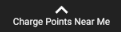
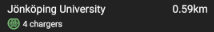

# Documentation for FlexiCharge Native Android Application

## Code structure

## The application

### Configuration Files

1. Google Maps SDK API key
   * Enter a Google Maps SDK api-key in the file ./app/src/debug/res/values/google_maps_api.xml by replacing `PUT_API_KEY_HERE` with the actual key
2. Klarna testing account
   * Using klarna requires Klarna Playgrond sample data. Use these personal details (You will only need to enter email and zip code once, then it will be remembered inside the app):
     

### Build Steps

1. Open project in Android Studio
2. Let gradle download all required modules
3. Compile and run application by clicking "Run"

### Using the app

1. Upon starting the app, grant required location permissions to continue to Home.

2. In home, the user can do a multitude of things...

   * Use the map to view FlexiChargers on the map.
     

   * Tap  to "warp" to your location. 

   * Tap the  to access QR Scanner
     * Scan a QR code present on a charger to access ChargingPanel with preenterd ID

   * Press the  to access the ChargingPanel. 

     * In ChargingPanel a user can do a plethera of things.
       

       * Tap to see a list of all ChargePoints and their distance to you by

       * View available Chargers inside a ChargePoint by tapping on a ChargePoint. 

       * Charge an electric vehicle.

          1. Entera valid chargerID, obtained by either...

             * Entering a valid ChargerID.
               
             * Scanning a QR Code 
             * Tapping a chargepoint in the chargepoint list and selecting one available charger.

          2. Tap  to make a monetary reservation for a charger. (Follow through Klarna steps, testing account described above in readme)

          3. Once reservation is complete the charging process will begin.
             

          4. To stop charging, either...

             * Wait for charge percentege to reach 100%

             * Tap  to manually stop charging.

          5. Upon finished charging a charging summary will be presented.
             

### Known issues

## Support

Create an issue on GitHub or contact our Scrum Leader at jofi1617@student.ju.se

## License