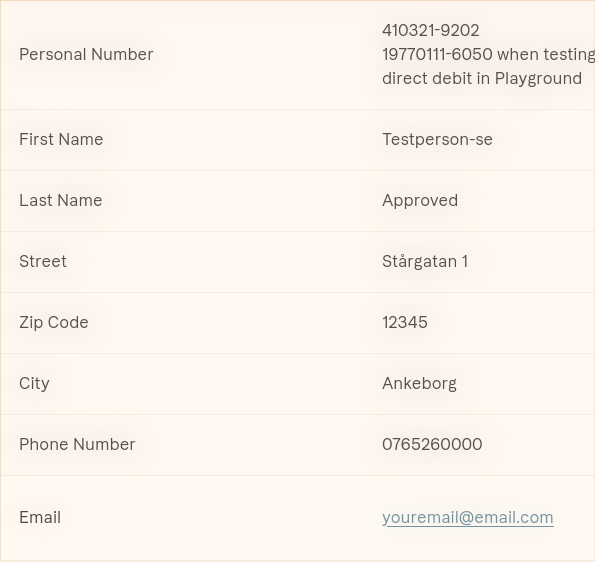
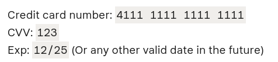
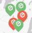
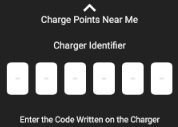
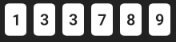
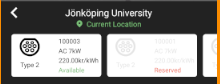
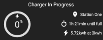
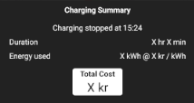

# Documentation for FlexiCharge Native Android Application

### Project Guidelines

#### Code structure

* **Class files are categorized into different packages, depending on their application.**
  Example 1: A map helper class is stored in ".../bolt/helper/MapHelper.kt"
  Example 2: A QR scanner activity is stored in ".../bolt/activities/QrActivity.kt"

#### Naming Convention

* **Camel casing is used for variable names.**
  Example: A list of chargers is named chargerList

* **ID's in Layout view's are identified by context, type of view and then name, separated by underscores**
  Example: A menu button in mainActivity would be named mainActivity_button_menu

## The application

### Configuration Files

1. **Google Maps SDK API key**
   Enter a Google Maps SDK api-key in the file ./app/src/debug/res/values/google_maps_api.xml by replacing `PUT_API_KEY_HERE` with the actual key

2. **Klarna testing account**
   Using klarna requires Klarna Playgrond sample data. Use these personal details (You will only need to enter email and zip code once, then it will be remembered inside the app):
   **Personal Details used for Bank Transfer**
   
     
   
   **Credit Card Details**

     

## Build Steps

1. Open project in Android Studio
2. Let gradle download all required modules
3. Compile and run application by clicking "Run"

## Using the app
1. When starting the app, grant required location permissions to continue to Home Screen.
2. In home, the user can do a multitude of things...
   * Use the map to view FlexiChargers on the **map**. 
   * Tap  to "warp" to **your location**. 
   * Tap  to access FlexiCharger **QR Scanner**
   * Tap  to access the **ChargingPanel**.    

### To charge

1. Enter a valid ChargerID pin in the ChargingPanel...  ...ChargerID's can be obtained by:
   * Tapping green markers on the map.
   * Scanning a QR Code present on a FlexiCharger
   * Tapping a chargepoint from the "chargepoints near me" list and selecting one available charger.

     
2. Tap  to make a monetary reservation for a charger. (Follow through Klarna steps, testing account described above in readme)
3. Once reservation is complete the charging process will begin automatically.

   
4. To stop charging, either..
   * Wait for charge percentege to reach 100%
   * Tap  to manually stop charging.
5. Upon finished charging a charging summary will be presented as such.

   

---

### Known issues

## Support

Create an issue on GitHub or contact our Scrum Leader at jofi1617@student.ju.se

## License
